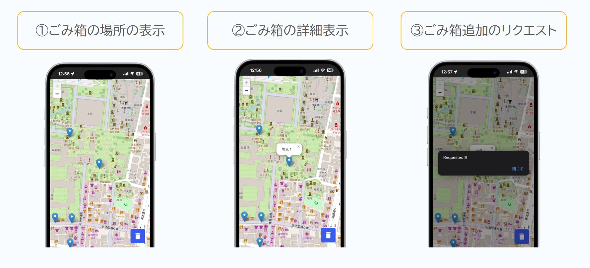

# smago-map

<!-- /docs/image.png -->


[Enginner Guild Hackathon 2024](https://speakerdeck.com/ryutarom/egh-timu16)に参加したときのプロダクトです。

## 説明資料

予選の資料は[こちら](https://speakerdeck.com/ryutarom/egh-timu16)

決勝の資料は[こちら]([https://speakerdeck.com/ryutarom/egh-timu16](https://speakerdeck.com/ryutarom/engineer-guild-hackathon-2024-jue-sheng-timu16))

## 動かし方
1.
```bash
git clone https://github.com/MRyutaro/smago-map.git
```

2.

./.envと./backend/.envファイルを作成

3.
```
docker compose up -d
```
